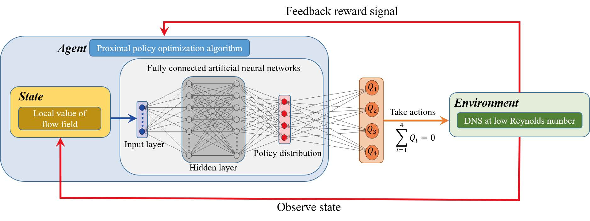
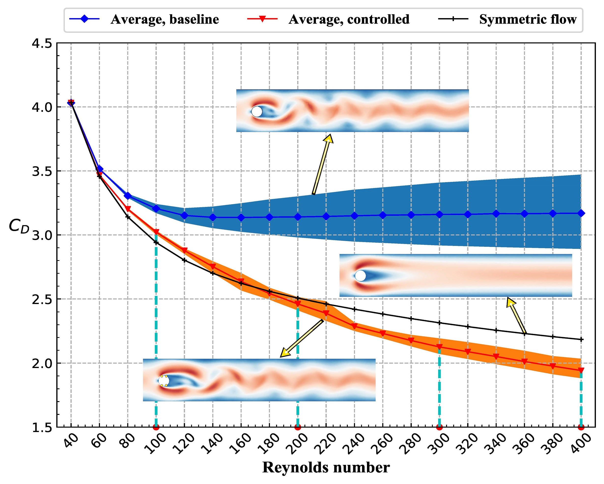

# Cylinder2DFlowControlGeneral

This repository contains the code corresponding to our manuscript, "Robust
active flow control over a range of Reynolds numbers using an artificial neural
network trained through deep reinforcement learning", Tang *et al.*, Physics of
Fluids (2020), preprint is available at https://arxiv.org/abs/2004.12417

This work focuses on the active flow control of a computational fluid dynamics
simulation over a range of Reynolds numbers using deep reinforcement learning
(DRL). The DRL framework utilized in the present work for performing AFC is
shown as follow:

The environment, i.e., a numerical simulation of the flow past a cylinder, is
coupled in a closed-loop fashion with the learning agent. Iteratively, the mass
flow rate of the jets is controlled by the agent according to the observed flow
state. In response, the simulation produces the updated flow field as next
state, and a reward signal is used to guide the control strategy towards
controlling the flow so as to reduce the drag. 

The learning environment supports four flow configurations with Reynolds numbers
100, 200, 300 and 400. It is shown that the DRL controller is able to
significantly reduce the lift and drag fluctuations and to actively reduce the
drag by approximately 5.7%, 21.6%, 32.7%, and 38.7%, at *Re*=100, 200, 300, and
400 respectively. More importantly, it can also effectively reduce drag for any
previously unseen value of the Reynolds number between 60 and 400, as indicated
by the following results:

# Getting started

The main code is located in **RobustDRLCylinder2DControl**. You can use the code
to obtain a model that is capable to take effective control over a range of
Reynolds numbers. The model we obatined for the results presented in our paper
is located in **BestModel**. The recommended method of execution is with the
docker container provided at . For details about how to launch the simulation,
please see [this video](https://asciinema.org/a/326357).

This work is based on the multi-environment approach proposed by Rabault and
Kuhnle, and the reader can also refer to the open source code
https://github.com/jerabaul29/Cylinder2DFlowControlDRLParallel.

# Help

If you encounter problems, please:

- look for help in the readme file of this repo as well as the tutorial video.
- look for help on the repo for [serial
  training](https://github.com/jerabaul29/Cylinder2DFlowControlDRL) and
  [parallel
  taining](https://github.com/jerabaul29/Cylinder2DFlowControlDRLParallel).
- feel free to open an issue and ask for help.

# Notes
- You can use **script_launch_parallel.sh** to launch the simulation or run
  **launch_servers.py** and **launch_parallel_training.py** respectively.
- For evaluating the obtained model/policy, run **single_runner.py**.
- You can refer to this [tutorial](https://fenics-containers.readthedocs.io/en/latest/introduction.html#running-fenics-in-docker)
  for the details about running fenics in docker.